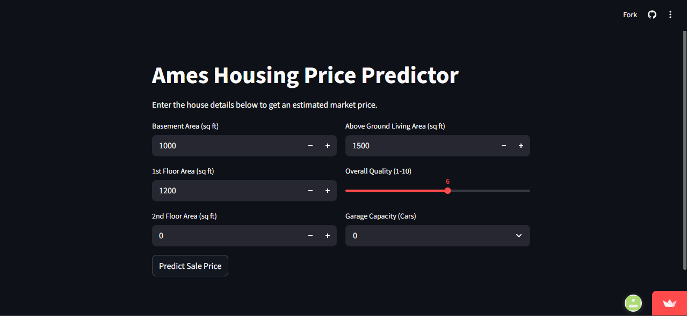

# Ames Housing Price Predictor

A machine learning project that predicts residential home prices in Ames, Iowa, using a highly optimized XGBoost regression model. This project demonstrates the full ML lifecycle: EDA, Data Cleaning, Feature Engineering, Model Benchmarking, and Deployment.



**[View Live Demo](https://xgboost-ames-housing-prediction-qmquwaycvmjnh9cfxmhejy.streamlit.app/)**

---

## Project Overview
The goal of this project was to move beyond simple "notebook" modeling and create a functional tool. By comparing different algorithms, I identified that gradient boosting offered the most robust handling of the dataset's complex features.

### Limitations
While this model is trained on historical data (2006-2010) and is not suitable for current market valuations, the architecture demonstrates a production-ready approach to regression.

### Key Features:
* **Automated Pipeline:** Custom cleaning script to handle 80+ original features.
* **Feature Engineering:** Combined basement and floor areas into a `TotalSF` metric for better predictive power.
* **Comparison Study:** Benchmarked three distinct models to find the best balance of bias and variance.
* **Interactive UI:** Streamlit interface for real-time price estimation.

---

## Model Performance
I evaluated the models based on **RMSE (Root Mean Squared Error)** to ensure large errors were properly penalized—a necessity in high-value real estate transactions.

| Model | RMSE (USD) |
| :--- | :--- |
| Linear Regression | $31,541.60 |
| Random Forest | $25,725.94 |
| **XGBoost (Selected)** | **$23,656.86** |

**Final R² Score:** `0.93` (The model explains ~93% of the price variance).

---

## Tech Stack
* **Language:** Python 3.11
* **Libraries:** Scikit-Learn, XGBoost, Pandas, NumPy
* **Deployment:** Streamlit & GitHub
* **Data Source:** [Ames Housing Dataset (Kaggle)](https://www.kaggle.com/datasets/prevek18/ames-housing-dataset/data)

---

## File Structure
* `app.py`: The Streamlit web application code.
* `dataset`: The raw dataset folder for this project.
* `notebooks/eda.ipynb`: Visualize distributions, correlations, and missing values.
* `notebooks/train_model.ipynb`: Script for modular cleaning, feature engineering logic, model comparison and serialization.
* `models/`: Saved `.pkl` files (XGBoost model and feature list).
* `requirements.txt`: List of dependencies for cloud deployment.

---

## How to Run Locally
1. Clone the repo:
   ```bash
   git clone https://github.com/asymihoney/XGBoost-Ames-Housing-Prediction.git

2. Install dependencies:
   ```bash
   pip install -r requirements.txt

3. Run the app:
   ```bash
   python -m streamlit run app.py